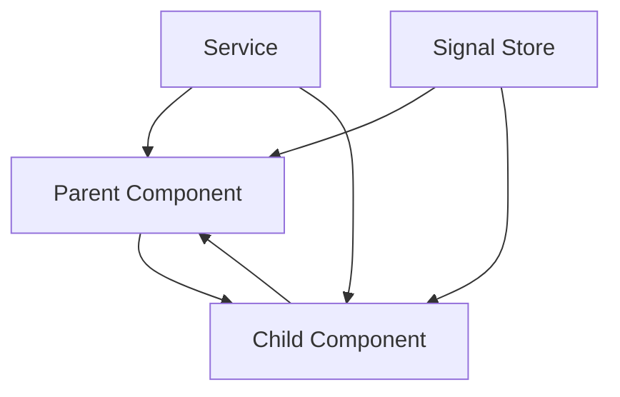
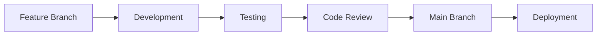

# AUM UI - Architecture Documentation

This document provides a comprehensive overview of the AUM UI project architecture, design decisions, and technical implementation details.

## 📋 Table of Contents

- [Overview](#overview)
- [Technology Stack](#technology-stack)
- [Project Structure](#project-structure)
- [Component Architecture](#component-architecture)
- [State Management](#state-management)
- [Styling Architecture](#styling-architecture)
- [Build & Deployment](#build--deployment)
- [Development Workflow](#development-workflow)

---

## 🏗️ Overview

AUM UI is a modern Angular component library built using:

- **NX Monorepo** for scalable development and code organization
- **Angular 20** with standalone components and signals
- **Material Design 3** for consistent theming
- **TypeScript** for type safety and developer experience

### Core Principles

1. **Modularity** - Each feature is a separate NX library
2. **Reusability** - Components are designed for maximum reuse
3. **Consistency** - Unified design system and coding standards
4. **Performance** - Optimized for bundle size and runtime efficiency
5. **Accessibility** - WCAG compliant components

---

## 🛠️ Technology Stack

### Core Technologies

| Technology       | Version | Purpose              |
| ---------------- | ------- | -------------------- |
| Angular          | 20.x    | Frontend framework   |
| NX               | 21.x    | Monorepo tooling     |
| TypeScript       | 5.8.x   | Language             |
| Angular Material | 20.x    | UI components        |
| RxJS             | 7.8.x   | Reactive programming |
| Jest             | 29.x    | Testing framework    |

### Development Tools

| Tool                   | Purpose                     |
| ---------------------- | --------------------------- |
| ESLint                 | Code linting                |
| Prettier               | Code formatting             |
| Angular CLI            | Development server & builds |
| Material Theme Builder | Theme generation            |

---

## 📁 Project Structure

```
aum-core/
├── apps/
│   └── aum-core/                 # Main application
│       ├── src/
│       │   ├── app/
│       │   │   ├── app.component.ts
│       │   │   ├── app.routes.ts  # Route configuration
│       │   │   └── app.config.ts  # App configuration
│       │   └── main.ts
│       └── public/               # Static assets
├── libs/
│   ├── aum/                     # Core AUM libraries
│   │   ├── ui/                  # Reusable UI components
│   │   │   ├── buttons/
│   │   │   ├── form-controls/
│   │   │   ├── layout/
│   │   │   ├── navigation/
│   │   │   ├── dialogs/
│   │   │   └── utilities/
│   │   ├── theme/               # Theming & styling
│   │   │   ├── src/
│   │   │   │   ├── styles/
│   │   │   │   └── assets/
│   │   ├── utils/               # Services & utilities
│   │   └── templates/           # Template components
│   └── modules/                 # Application modules
│       ├── dashboard/           # Dashboard feature
│       └── playground/          # Component showcase
├── docs/                       # Documentation
├── tools/                      # Build tools & scripts
└── package.json
```

### Library Organization

#### Core Libraries (`libs/aum/`)

**UI Components (`libs/aum/ui/`)**

```
ui/
├── buttons/
│   └── button/
├── form-controls/
│   ├── input/
│   ├── checkbox/
│   ├── radio-button/
│   ├── select-box/
│   ├── date-picker/
│   └── autocomplete/
├── layout/
│   ├── page/
│   └── card/
├── navigation/
│   ├── breadcrumb/
│   ├── menu-list/
│   └── side-menu/
├── dialogs/
│   ├── confirmation-dialog/
│   └── generic-dialog/
└── utilities/
   └── snackbar/
```

**Theme System (`libs/aum/theme/`)**

```
theme/
├── src/
│   ├── styles/
│   │   ├── themes/
│   │   │   └── theme-purple/
│   │   ├── utilities.scss
│   │   └── functions.scss
│   └── assets/
│       ├── icons/
│       ├── images/
│       └── svgs/
```

#### Application Modules (`libs/modules/`)

**Dashboard Module**

- Welcome section with statistics
- Component showcase
- Feature highlights
- Responsive design

**Playground Module**

- Interactive component testing
- Tabbed interface
- Live component demos
- Code examples

---

## 🧩 Component Architecture

### Standalone Component Pattern

All components follow Angular's standalone component pattern:

```typescript
@Component({
  selector: 'aum-button',
  standalone: true,
  imports: [CommonModule, MatButtonModule, MatIconModule],
  templateUrl: './button.component.html',
  styleUrl: './button.component.scss',
  changeDetection: ChangeDetectionStrategy.OnPush,
})
export class ButtonComponent {
  // Component implementation
}
```

### Component Categories

#### 1. Presentational Components

- **Purpose**: Display data and handle user interactions
- **Examples**: `ButtonComponent`, `CardComponent`
- **Characteristics**:
- Receive data via `@Input()`
- Emit events via `@Output()`
- No direct service dependencies
- Highly reusable

#### 2. Container Components

- **Purpose**: Manage state and orchestrate child components
- **Examples**: `Dashboard`, `Playground`
- **Characteristics**:
- Inject services
- Manage local state
- Handle business logic

#### 3. Layout Components

- **Purpose**: Provide structure and navigation
- **Examples**: `PageComponent`, `SideMenuComponent`
- **Characteristics**:
- Use content projection
- Handle responsive behavior
- Integrate with routing

### Component Communication



#### Patterns Used:

- **Parent → Child**: `@Input()` properties
- **Child → Parent**: `@Output()` events
- **Sibling Components**: Shared services or signals
- **Global State**: Signal-based state management

---

## 📊 State Management

### Signal-Based State Management

AUM UI uses Angular Signals for reactive state management:

```typescript
export class ComponentStateService {
  // Private writable signal
  private readonly _loading = signal(false);

  // Public readonly signal
  readonly loading = this._loading.asReadonly();

  // Computed signals
  readonly canSubmit = computed(() => !this.loading() && this.formValid());

  // State mutations
  setLoading(loading: boolean): void {
    this._loading.set(loading);
  }
}
```

### State Architecture Layers

1. **Component State**: Local component state using signals
2. **Feature State**: Shared state within feature modules
3. **Global State**: Application-wide state via services
4. **Server State**: API data management with RxJS

---

## 🎨 Styling Architecture

### Material Design 3 System

The styling system is built on Material Design 3 principles with **mandatory requirements** for UI development:

#### ⚠️ CRITICAL: UI Development Requirements

**Every UI component MUST follow these rules:**

1. **Theme Variables Only**: All colors must use Material system variables
2. **Scalable Dimensions**: All dimensions must use the rem() function
3. **UI Scaling Support**: Components must work in Default/Large/Compact modes
4. **Light/Dark Mode**: Complete theme switching support

#### Theme Variables Structure

```scss
:root {
  /* Primary Palette - Auto-adapts for light/dark mode */
  --mat-sys-primary: light-dark(#5e46cf, #c9bfff);
  --mat-sys-on-primary: light-dark(#ffffff, #2f009c);
  --mat-sys-primary-container: light-dark(#e5deff, #4628b7);
  --mat-sys-on-primary-container: light-dark(#1a0063, #e5deff);

  /* Surface & Background - Theme-aware */
  --mat-sys-surface: light-dark(#f9f9f9, #121414);
  --mat-sys-on-surface: light-dark(#1a1c1c, #e2e2e2);
  --mat-sys-background: light-dark(#f9f9f9, #121414);
  --mat-sys-surface-container: light-dark(#eeeeee, #1e2020);

  /* Semantic Colors */
  --mat-sys-error: light-dark(#c00000, #ffb4a8);
  --mat-sys-outline: light-dark(#767777, #909191);
  --mat-sys-outline-variant: light-dark(#c6c6c7, #454747);
}
```

#### UI Scaling System

The rem() function supports three display modes:

```scss
/* Base rem values change based on user preference */
:root {
  /* Compact Mode */
  --base-font-size: 14px;

  /* Default Mode (default) */
  --base-font-size: 16px;

  /* Large Mode */
  --base-font-size: 18px;
}

/* Components automatically scale with rem() */
.component {
  padding: rem(16); // 14px/16px/18px based on mode
  font-size: rem(14); // 12.25px/14px/15.75px based on mode
  min-height: rem(44); // 38.5px/44px/49.5px based on mode
}
```

#### Component Styling Pattern

```scss
.aum-component {
  // ✅ REQUIRED: Base styles using theme variables + rem() function
  color: var(--mat-sys-on-surface);
  background-color: var(--mat-sys-surface);
  padding: rem(16); // Scalable padding
  font-size: rem(14); // Scalable typography
  border-radius: rem(8); // Scalable border radius
  min-height: rem(44); // Scalable touch targets

  // Modifiers with theme variables
  &--variant {
    background-color: var(--mat-sys-primary);
    color: var(--mat-sys-on-primary);
  }

  // States using theme variables
  &:hover {
    background-color: var(--mat-sys-surface-container);
  }

  &:focus {
    outline: rem(2) solid var(--mat-sys-primary);
    outline-offset: rem(2);
  }

  &:disabled {
    background-color: var(--mat-sys-surface);
    color: var(--mat-sys-on-surface-variant);
    opacity: 0.6;
    pointer-events: none;
  }

  // Responsive design with scalable units
  @media (max-width: 768px) {
    padding: rem(12); // Scales with user preference
    font-size: rem(12); // Maintains proportions
  }
}
```

#### UI Scaling Implementation

```scss
// Functions.scss - rem() function implementation
@function rem($pixels) {
  @return #{$pixels / 16}rem; // Converts px to rem for scaling
}

// Usage examples showing proper implementation
.button {
  // All dimensions MUST use rem() function
  padding: rem(12) rem(24); // Not 12px 24px
  font-size: rem(16); // Not 16px
  min-height: rem(44); // Not 44px
  border-radius: rem(6); // Not 6px
  margin: rem(8); // Not 8px

  // Colors MUST use theme variables
  background-color: var(--mat-sys-primary); // Not #5e46cf
  color: var(--mat-sys-on-primary); // Not #ffffff
  border: rem(1) solid var(--mat-sys-outline); // Not 1px solid #ccc
}
```

### CSS Architecture

#### Utility Classes

```scss
/* Layout utilities */
.flex-row {
  display: flex;
}
.flex-column {
  display: flex;
  flex-direction: column;
}
.justify-center {
  justify-content: center;
}
.align-center {
  align-items: center;
}

/* Spacing utilities */
.margin-8 {
  margin: 0.5rem;
}
.margin-16 {
  margin: 1rem;
}
.padding-8 {
  padding: 0.5rem;
}
.padding-16 {
  padding: 1rem;
}

/* Typography utilities */
.fs-12 {
  font-size: 0.75rem;
}
.fs-14 {
  font-size: 0.875rem;
}
.fw-500 {
  font-weight: 500;
}
.fw-600 {
  font-weight: 600;
}
```

---

## 🔄 Build & Deployment

### NX Build System

#### Project Configuration

```json
{
  "name": "aum-ui",
  "targets": {
    "build": {
      "executor": "@angular-devkit/build-angular:browser",
      "options": {
        "outputPath": "dist/apps/aum-core",
        "index": "apps/aum-core/src/index.html",
        "main": "apps/aum-core/src/main.ts"
      }
    },
    "serve": {
      "executor": "@angular-devkit/build-angular:dev-server"
    },
    "test": {
      "executor": "@nx/jest:jest"
    }
  }
}
```

#### Build Optimization

- **Tree Shaking**: Unused code elimination
- **Code Splitting**: Route-based lazy loading
- **Bundle Analysis**: Size monitoring and optimization
- **Compression**: Gzip and Brotli compression

### Development Server

```bash
# Development server
nx serve aum-core

# Production build
nx build aum-core --configuration=production

# Run tests
nx test aum-core

# Lint code
nx lint aum-core
```

---

## 🚀 Development Workflow

### Git Workflow



#### Branch Strategy

- `main` - Production-ready code
- `develop` - Integration branch
- `feature/*` - New features
- `bugfix/*` - Bug fixes
- `hotfix/*` - Critical fixes

### Code Quality Pipeline

1. **Pre-commit Hooks**

- ESLint code linting
- Prettier code formatting
- Type checking

2. **Automated Testing**

- Unit tests (Jest)
- Component tests
- Integration tests

3. **Build Verification**

- Production build success
- Bundle size analysis
- Performance metrics

### Component Development Lifecycle

1. **Planning**

- Requirements analysis
- Design system alignment
- API design

2. **Implementation**

- Create component structure
- Implement core functionality
- Add styling with theme variables

3. **Testing**

- Unit tests
- Accessibility testing
- Cross-browser testing

4. **Documentation**

- Component API documentation
- Usage examples
- Storybook stories (if applicable)

5. **Integration**

- Add to component library
- Update playground demos
- Version management

---

## 🔌 Integration Points

### External Dependencies

#### Angular Material

- **Purpose**: Base UI components and theming
- **Integration**: Extended and customized components
- **Version**: 20.x (aligned with Angular)

#### RxJS

- **Purpose**: Reactive programming and async operations
- **Usage**: HTTP requests, event handling, state streams
- **Patterns**: Observables, operators, subjects

### API Integration

```typescript
// Service layer for API communication
@Injectable({ providedIn: 'root' })
export class ApiService {
  private readonly http = inject(HttpClient);
  private readonly baseUrl = environment.apiUrl;

  get<T>(endpoint: string): Observable<T> {
    return this.http
      .get<T>(`${this.baseUrl}/${endpoint}`)
      .pipe(catchError(this.handleError));
  }

  private handleError(error: HttpErrorResponse): Observable<never> {
    // Error handling logic
    return throwError(() => error);
  }
}
```

---

## 🎨 UI Scaling & Theming Architecture

### Display Mode Support

The AUM UI system supports three display modes that affect all components:

#### 1. Compact Mode

- **Use Case**: Dense information display, power users
- **Base Font Size**: 14px
- **Scaling Factor**: 0.875x
- **Touch Targets**: Minimum 40px (rem(40))
- **Padding/Margins**: Reduced by 12.5%

#### 2. Default Mode (Standard)

- **Use Case**: General usage, balanced approach
- **Base Font Size**: 16px
- **Scaling Factor**: 1x (baseline)
- **Touch Targets**: Minimum 44px (rem(44))
- **Padding/Margins**: Standard sizing

#### 3. Large Mode

- **Use Case**: Accessibility, older users, mobile focus
- **Base Font Size**: 18px
- **Scaling Factor**: 1.125x
- **Touch Targets**: Minimum 48px (rem(48))
- **Padding/Margins**: Increased by 12.5%

### Theme System Implementation

```scss
// Theme switching implementation
:root {
  // Light theme (default)
  color-scheme: light;
  --mat-sys-surface: #f9f9f9;
  --mat-sys-on-surface: #1a1c1c;
}

[data-theme='dark'] {
  // Dark theme override
  color-scheme: dark;
  --mat-sys-surface: #121414;
  --mat-sys-on-surface: #e2e2e2;
}

// Automatic theme switching based on system preference
@media (prefers-color-scheme: dark) {
  :root:not([data-theme]) {
    --mat-sys-surface: #121414;
    --mat-sys-on-surface: #e2e2e2;
  }
}
```

### Component Scaling Requirements

Every component must be tested and validated in all three modes:

```scss
// Example: Button component scaling validation
.aum-button {
  // Base implementation
  padding: rem(12) rem(24); // 10.5px/12px/13.5px across modes
  font-size: rem(14); // 12.25px/14px/15.75px across modes
  min-height: rem(44); // 38.5px/44px/49.5px across modes

  // Must work perfectly in all scaling modes
  // ✅ Compact: Smaller, denser appearance
  // ✅ Default: Standard comfortable sizing
  // ✅ Large: Bigger, more accessible sizing
}
```

---

## 📈 Performance Considerations

### Bundle Optimization

- **Lazy Loading**: Route-level code splitting
- **Tree Shaking**: Unused code elimination
- **Theme Variables**: CSS custom properties for efficient theming
- **Scalable Units**: rem() function reduces style recalculation
- **Module Federation**: Micro-frontend architecture (future)

### Runtime Performance

- **OnPush Change Detection**: Optimized change detection
- **Signals**: Fine-grained reactivity
- **Virtual Scrolling**: Large list optimization
- **Image Optimization**: Lazy loading and compression

### Memory Management

- **Subscription Management**: Automatic unsubscription
- **Component Lifecycle**: Proper cleanup
- **WeakMap Usage**: Prevent memory leaks

---

## 🔒 Security Considerations

### Input Validation

- **Type Safety**: TypeScript interfaces
- **Runtime Validation**: Input sanitization
- **XSS Prevention**: Safe HTML rendering

### Authentication & Authorization

- **JWT Tokens**: Secure authentication
- **Route Guards**: Access control
- **Role-Based Permissions**: Feature-level authorization

---

## 📊 Monitoring & Analytics

### Build Metrics

- Bundle size tracking
- Build time optimization
- Dependency analysis

### Runtime Monitoring

- Performance metrics
- Error tracking
- User analytics (optional)

---

## 🔮 Future Architecture Plans

### Scalability Improvements

1. **Micro-frontend Architecture**: Module federation
2. **Server-Side Rendering**: Angular Universal
3. **Progressive Web App**: Service workers and caching
4. **Component Library Publishing**: NPM package distribution

### Technology Upgrades

- Angular version updates
- NX version updates
- Modern CSS features (Container queries, CSS Grid)
- Web Components integration

---

_This architecture documentation will evolve with the project and updated as new patterns and practices are adopted._
